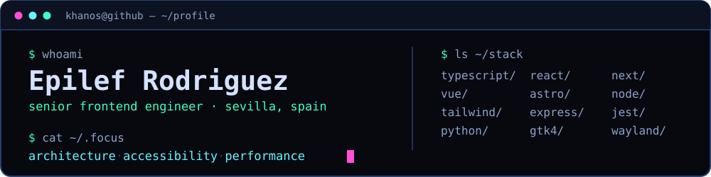

### I build web frontends for a living, and read `/sys/class/hwmon` for fun.

Frontend engineer in Sevilla. I care about component architecture that survives a second team
touching it, accessibility that isn't retrofitted, and performance work that holds up once real
content lands. Most of my working code sits in private repositories — what's public here is side
work, deliberate framework study, and the occasional detour well below the browser.

[**khanos.github.io**](https://khanos.github.io/) · [Portfolio](https://khanos-frontend.vercel.app) · [LinkedIn](https://www.linkedin.com/in/khanos/) · [X](https://twitter.com/EpilefRodriguez) · [HackerRank](https://www.hackerrank.com/khanosve)

---

## Selected work

#### [oVitals](https://github.com/Khanos/ovitals) — a native hardware monitor for Omarchy and Wayland
`Python` · `GTK 4` · `libadwaita` · `hwmon`

Reads `/sys/class/hwmon` and `cpufreq` directly, with no monitoring daemon in between, and tracks
per-sensor session minimums and maximums. Picks up the active Omarchy palette live. The design rule
is that a value the kernel doesn't expose gets reported as missing rather than inferred, and the test
suite runs against a synthetic sysfs tree so it never touches system files. The fan and voltage
research behind it is written up in
[`SENSOR_SUPPORT_RESEARCH.md`](https://github.com/Khanos/ovitals/blob/main/SENSOR_SUPPORT_RESEARCH.md),
including why blind `sensors-detect` probing is a bad idea.

#### [khanos.backend](https://github.com/Khanos/khanos.backend) — the API behind my site
`Node.js` · `Express` · `MongoDB` · `Jest`

Controllers, services and models in separate layers, behind `helmet`, CORS, rate limiting and one
central error-handling middleware. Endpoints for GitHub commit search, a Mongoose-backed URL
shortener, and Gemini text, chat and image prompts. Ten test files cover controllers, services,
models, middleware and utils; CI lints and runs them on every push and pull request.

#### [southern-code-challenge](https://github.com/Khanos/southern-code-challenge) — 3D product catalogue, typed end to end
`Next.js` · `TypeScript` · `tRPC` · `Drizzle` · `PostgreSQL` · `React Three Fiber`

An interview challenge where the interesting constraints were the optional ones. tRPC and Drizzle
were listed as bonus points, so that's the version I built: a React Three Fiber model viewer, likes
and comment CRUD, and types that hold from the Postgres schema through to the component.

#### [khanos.frontend](https://github.com/Khanos/khanos.frontend) — portfolio, on its fifth framework
`Astro` · `TypeScript` · `Tailwind`

Angular, then Vue, then vanilla JS, then Next.js, now Astro with React islands. Roughly the same
content each time — the rewrites were the point. Ships image optimization, HTML compression, a
generated sitemap and `robots.txt`.

#### [khanos.github.io](https://github.com/Khanos/khanos.github.io) — personal site, no framework at all
`HTML` · `CSS` · `Vanilla JS`

Semantic markup, CSS custom properties, mobile-first, and a typewriter intro that steps aside for
`prefers-reduced-motion`. It's here to keep me honest about doing this without a build step.

#### [leetcode-challenges](https://github.com/Khanos/leetcode-challenges) — 23 solutions, all under test
`TypeScript` · `JavaScript` · `Jest`

Algorithm practice with `ts-jest`, a shared ESLint config and a test file per solution, on the theory
that a kata you can't re-run isn't practice.

---

## The workbench habit

I keep a scratch repo for each technology I want to understand rather than skim:
[React](https://github.com/Khanos/workbench-react),
[Vue](https://github.com/Khanos/workbench-vue),
[Angular](https://github.com/Khanos/workbench-angular),
[Next.js](https://github.com/Khanos/workbench-nextjs),
[Ionic](https://github.com/Khanos/workbench-ionic),
[Socket.IO](https://github.com/Khanos/workbench-socket-io),
[Docker](https://github.com/Khanos/workbench-docker).

They are deliberately rough. It's where a framework gets taken apart before it goes anywhere near
production code, and it's most of the reason I don't have strong feelings about which one a team has
already picked.

---

`epilef` is `felipe` backwards. It's still the first thing people ask.
